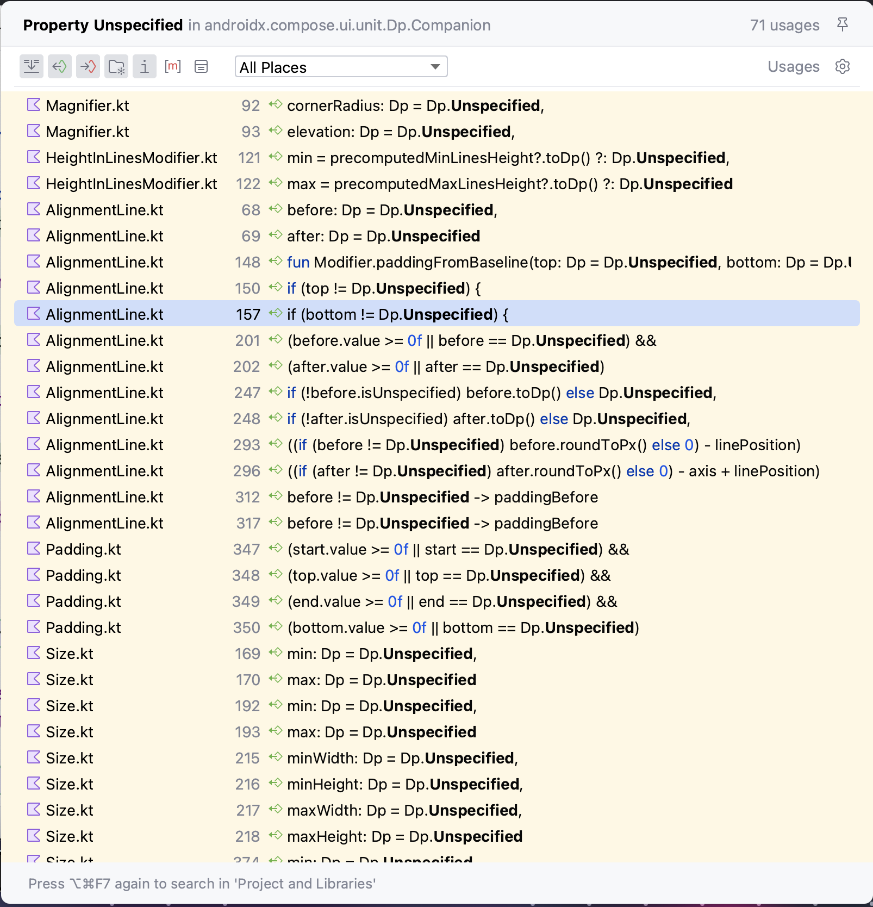
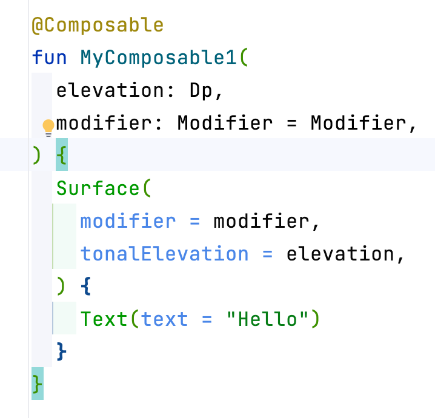

# Looking at `Dp` class in Jetpack Compose

## Why @Composable functions in Jetpack Compose usually use `Dp.Unspecified` as default value? Why not use null?

## The optimization of Jetpack Compose under the hood

### Author: [Petrus Nguyễn Thái Học](https://github.com/hoc081098)

- _Tags_: #hoc081098, #rx_mobile_team, #kotlindev #androiddev, #rxandroid, #jetpack_compose, #value_class

When using Jetpack Compose, we often use `Dp` class to represent a dimension value representing device-independent
pixels (dp)
It is used many times and everywhere in Jetpack Compose.

Do you have the same question as me, when looking Jetpack Compose source code:
**Why @Composable functions in Jetpack Compose usually use `Dp.Unspecified` as default value? Why not use null?**

<p align="center">
    
</p>

_Dp.Unspecified is usually used as default value in Jetpack Compose source code_

### I. `Dp` class

#### I.1. `Dp` class declaration

At the moment, `Dp` class is defined as follows:

```kotlin
@Immutable
@kotlin.jvm.JvmInline
value class Dp(val value: Float) : Comparable<Dp> {
    @Stable
    inline operator fun plus(other: Dp): Dp = ...

    @Stable
    inline operator fun minus(other: Dp): Dp = ...

    // [...]
    // Other operators ...
    // [...]

    @Stable
    override /* TODO: inline */ operator fun compareTo(other: Dp) = value.compareTo(other.value)

    @Stable
    override fun toString() = if (isUnspecified) "Dp.Unspecified" else "$value.dp"

    companion object {
        @Stable
        val Hairline = Dp(value = 0f)

        @Stable
        val Infinity = Dp(value = Float.POSITIVE_INFINITY)

        /**
         * Constant that means unspecified Dp
         */
        @Stable
        val Unspecified = Dp(value = Float.NaN)
    }
}
```

`Dp` class is declared as `inline value class` wrapping a `Float` value.
When compiling, the compiler will try to replace all `Dp` type with `Float` type as much as possible.
This reduces memory usage and improves performance, since heap allocation is eliminated,
and `Float` type, a primitive type, is usually heavily optimized by the runtime.
That is the optimization of Jetpack Compose.

> The inline class spec is [here](https://github.com/Kotlin/KEEP/blob/master/proposals/inline-classes.md).

#### I.2. Example

Let's create a simple example to see how the compiler optimizes `Dp` class, I create a `@Composable fun MyComposable1`
accepting a `Dp` as the first parameter.

<p align="center">
    
</p>

_MyComposable1 accepts a Dp as the first parameter_

After compile and decompile java bytecode to Java code, we can see that the compiler has replaced `Dp` type with `Float`
type.

<p align="center">
    
</p>

_Dp type is replaced with Float type_

You many notice that the method name has been changed, that is
called [mangling](https://kotlinlang.org/docs/inline-classes.html#mangling).
> Since inline classes are compiled to their underlying type, it may lead to various obscure errors, for example
> unexpected platform signature clashes.
> To mitigate such issues, functions using inline classes are mangled by adding some stable hashcode to the function
> name.

### II. Why @Composable functions in Jetpack Compose usually use `Dp.Unspecified` as default value? Why not use null?

### II.1. Why not use null?

After we look at the `Dp` class, we can understand why `Dp` declared as `inline value class` and why it is optimized by
the compiler.

<p align="center">
    
</p>

_Dp.Unspecified is usually used as default value in Jetpack Compose source code_

`Inline value class` and `Auto Boxing` are keywords here.

> “Boxing” refers to converting a primitive value into a corresponding wrapper object. Because this can happen
> automatically, it’s known as autoboxing.
> Similarly, when a wrapper object is unwrapped into a primitive value then this is known as unboxing.
> (https://www.baeldung.com/java-wrapper-classes#autoboxing-and-unboxing)

If we use `null` as default value, we must use `Dp?` type.
Since `Dp?` is a nullable type, compiler cannot use `Float` (aka `float` in Java) type to replace `Dp?` type.
Instead, `Dp?` must be used!!!

> nullable inline class types over primitive types are mapped to the boxed reference type (wrapper of an inline class)

`Dp?` is a reference type, not a primitive type, it requires **heap allocation**.
Imagine we use `Dp?` type in many places (the worst case is in a loop or is in List/Row/Column/... UI),
it will cause a lot of heap allocation, affect the application performance,
especially a UI application, its performance is very important to the user experience.

#### II.2. Example

Let's create a simple example using `Dp?` type, we create a `@Composable fun MyComposable2` accepting a `Dp?` as the
first parameter.

<p align="center">
    
</p>

_MyComposable2 accepts a Dp? as the first parameter_

After compile and decompile java bytecode to Java code, we can see that `Dp` type is not replaced with `Float` type,
it is preserved.
Inside `UseMyComposable2`, `Dp.box-impl(Dp.constructor-impl((float)$this$dp$iv))` is used to box a `Float` value to
a `Dp`.
It is a heap allocation.

<p align="center">
    
</p>

_Dp type is not replaced with Float type and heap allocation is used_

That is the reason why we must not use `null` as default value.
`Dp.Unspecified` is a better choice, it wraps a `Float.NaN` value.
Sometimes, we can use `Dp.Hairline` (aka `0.dp`) as default value, depending on your use case.

#### II.3. Bonus

- How about elvis operator `?:`?
- How about `== null`?

Jetpack Compose has replacements, they are `Dp.takeOrElse(block: () -> Dp): Dp` and `Dp.isUnspecified: Boolean`.
`takeOrElse` is an inline function, no lambda allocation, no heap allocation here 🥰.

<p align="center">
    
</p>

_Dp.takeOrElse and Dp.isUnspecified_