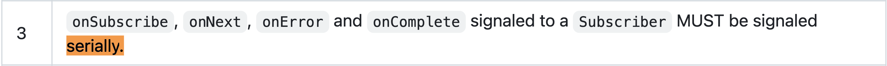
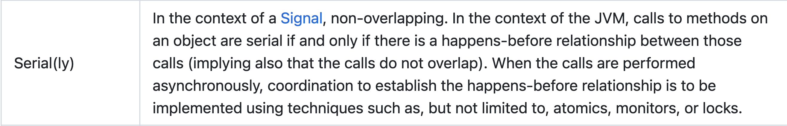
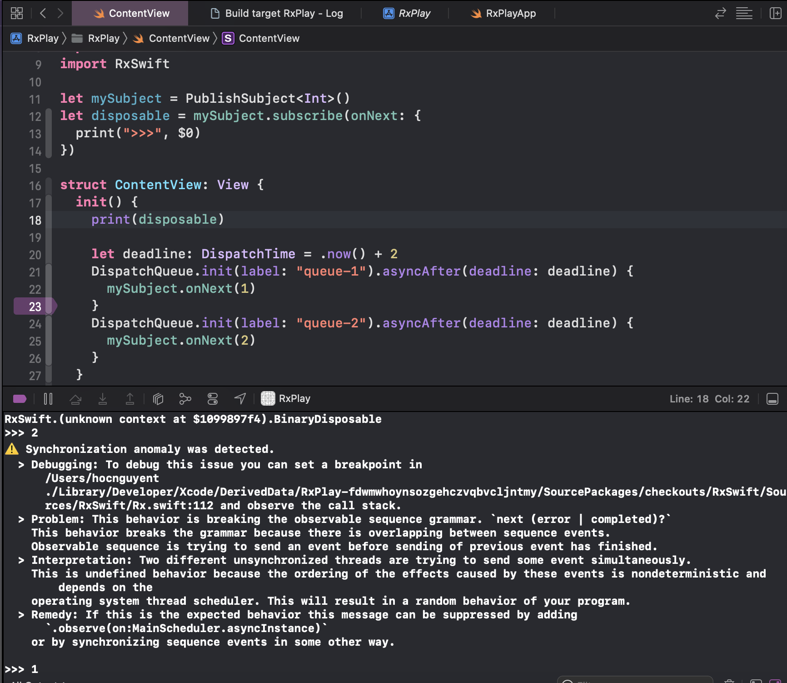
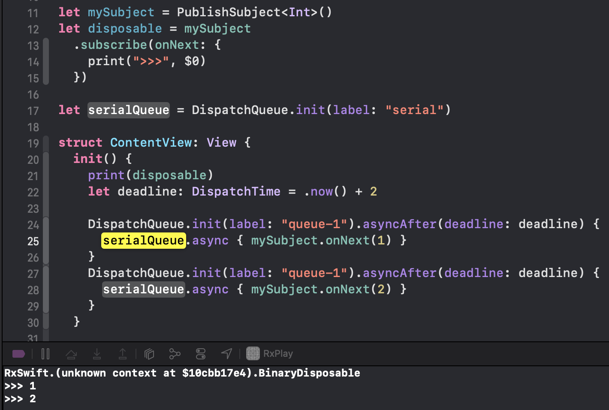
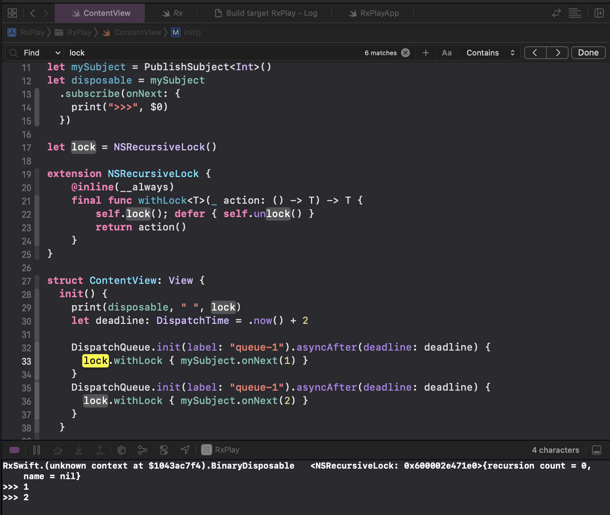
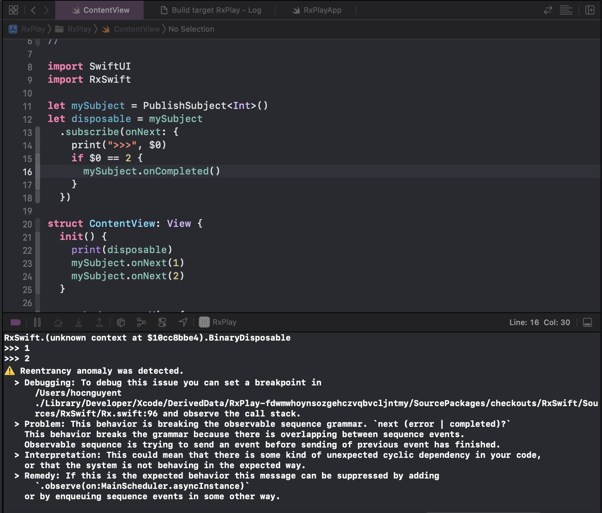
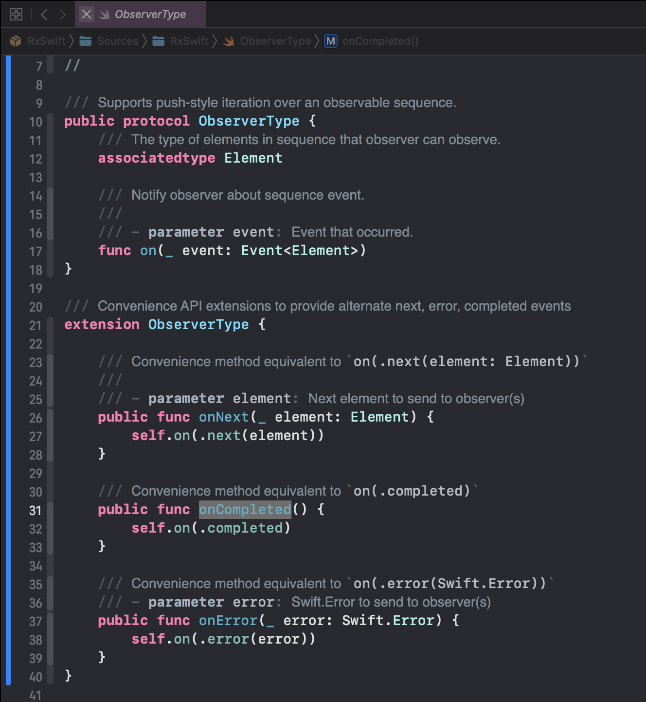
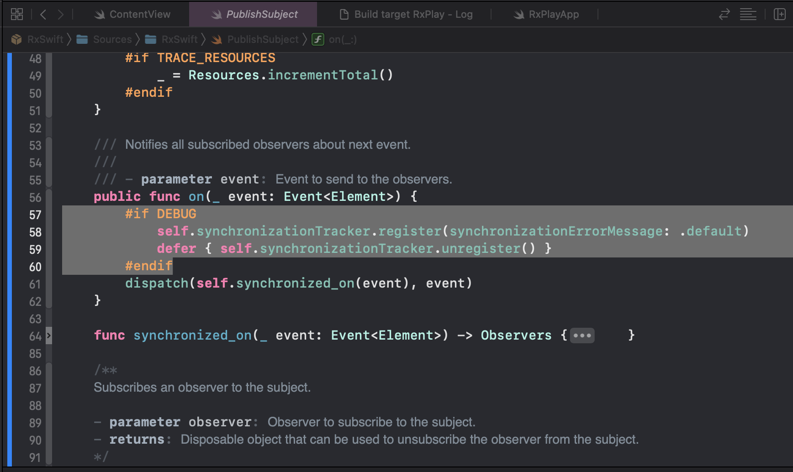
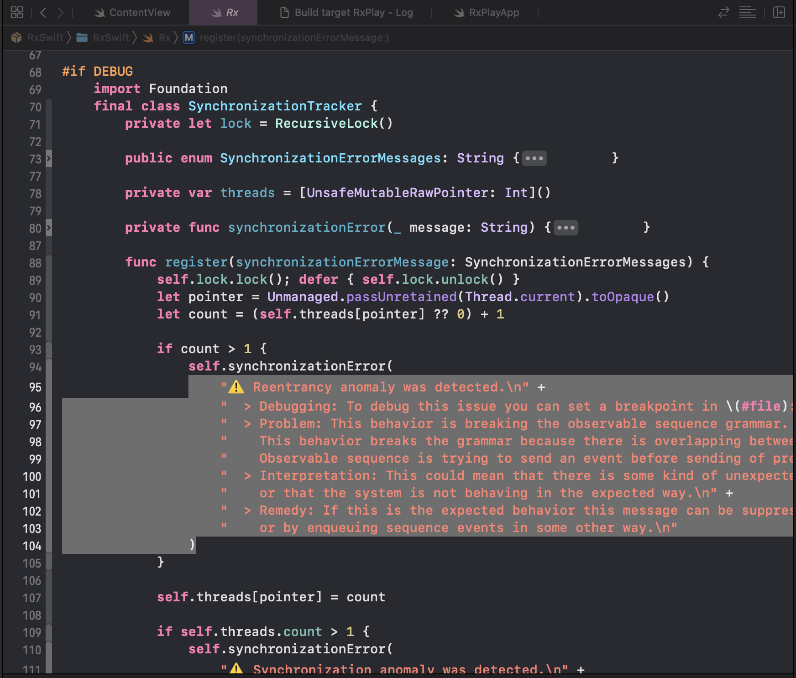
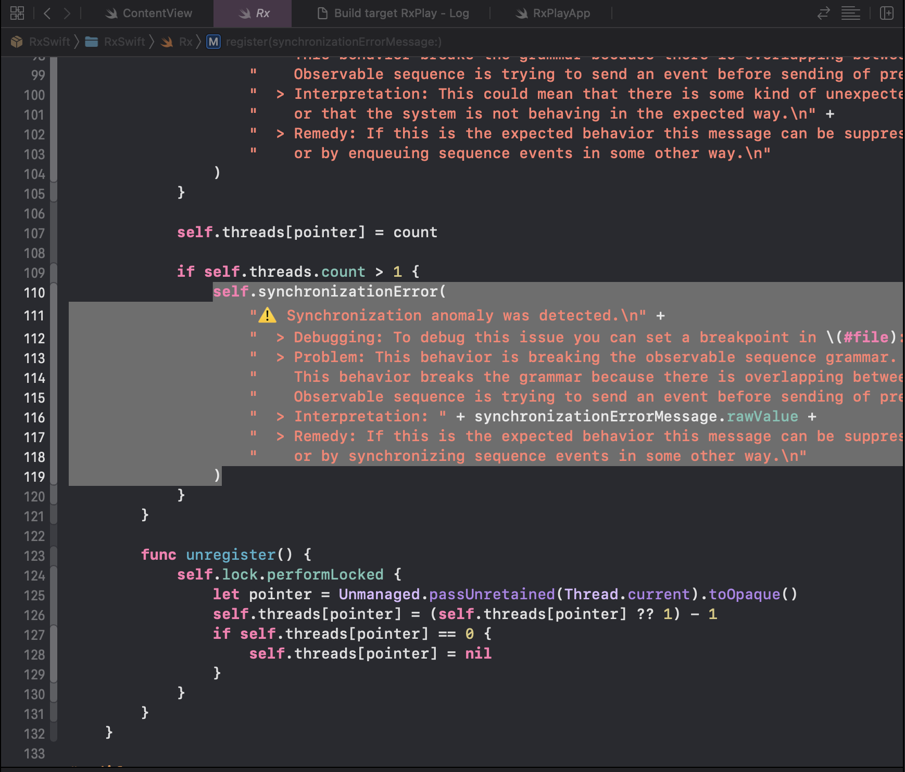

# Bàn về Subject trong Rx (ví dụ với RxSwift 😇)
# Subjects in Rx (with example in RxSwift 😇)

## Author: [Petrus Nguyễn Thái Học](https://github.com/hoc081098)

- _Tags_: #functional-programming, #hoc081098, #rx_mobile_team, #kotlindev #androiddev, #iosdev, #rxswift, #rxjava, #rxkotlin
#functional_reactive_programming, #reactive_programming, #reactive_extensions, #reactive_programming, #reactive_extensions, #rxjava2, #rxjava3, #rxswift, #rxkotlin, #rxandroid, #rxmobile

## I. Serially rule 😇

`Observable` trong `ReactiveX` phải thuân thủ quy tắc `Serially`, tức là phải đảm bảo các sự kiện phát ra không được overlap
 lên nhau. Quy tắc này không bắt buộc các event (signal) phải được delivered đến các subscriber ở cùng một thread. 
 Nó vẫn có thể được delivered đến các subscriber ở các thread khác nhau, 
 nhưng nó phải đảm bảo các event không được overlap lên nhau (tức phải đồng bộ thông qua các cơ chế như lock, atomic, ...).

Ví dụ: một Observable phát ra `onNext(1)`, `onNext(2)`, `onNext(3)` thì 1 subscriber có thể nhận 
`onNext(1)` ở thread A, `onNext(2)` ở thread B, `onNext(3)` ở thread A, 
nhưng nó không được phép nhận `onNext(2)` trong khi `onNext(1)` đang được delivered.

Hãy xem [Reactive Streams Specification for the JVM](http://www.reactive-streams.org/) để thấy rõ hơn.

## II. Subjects are not thread-safe on the Observer side 🥺

`Subject` không phải là thread-safe ở phía Observer.
Nếu chúng ta invoke `onNext`, `onError`, `onCompleted` trên `Subject` từ nhiều thread khác nhau thì có thể dẫn đến
các event bị overlap lên nhau, và điều này sẽ làm `Subject` không đảm bảo quy tắc `Serially` nữa.

Trong RxJava, tất cả Subject đều không thread-safe, ngoại trừ 
[`SerializedSubject`](https://github.com/ReactiveX/RxJava/blob/806ec1ca7d5ea50026f9019fc5b49ac70f7b1678/src/main/java/io/reactivex/rxjava3/subjects/SerializedSubject.java#L29). 
Chỉ cần gọi `toSerialized()` trên 1 Subject bất kì là chúng ta đã có được một `SerializedSubject`. `SerializedSubject` 
sẽ serialize các lời gọi tới method của Observer side, điều này được đảm bảo bằng 1 queue có type `AppendOnlyLinkedArrayList`
được synchronized bởi chính `SerializedSubject` đó, queue này sẽ giữ các event (signal/notification) bị missed,
để sau đó sẽ loop và deliver chúng đến các Observer một cách synchronized.

### 1. ⚠️ Synchronization anomaly was detected

Trong RxSwift, 4 loại Subject `PublishSubject`, `BehaviorSubject`, `ReplaySubject`, `AsyncSubject` đều không thread-safe.

✍️ Hãy lấy ví dụ với `PublishSubject`, gọi `onNext` trên `PublishSubject` từ nhiều thread khác nhau cùng lúc.

    

 > ❌ Lỗi này xảy ra khi event thứ nhất `onNext(1)` được send từ thread của `queue-1`, `onNext(2)` event sau lại được
 > send từ thread của `queue-2` trong khi event 1 đang được delivered,tức vẫn chưa hoàn thành việc delivery event 1.

🧐 RxSwift detect được chúng ta đang gọi từ nhiều thread khác nhau, sẽ log ra lỗi `⚠️ Synchronization anomaly was detected`. 
Nếu chúng ta enable flag `FATAL_SYNCHRONIZATION`, thì RxSwift sẽ crash app thông qua `fatalError`.

✅ Cách fix đơn giản nhất là tạo một `Serial DispatchQueue`, và đưa các lời gọi tới `PublishSubject` vào trong DispatchQueue đó.
 Hoặc sử dụng một `NsRecursiveLock` để đảm bảo các lời gọi tới Observer side của `PublishSubject` được synchronized.

    

_Serial DispatchQueue_

 
 

    

_NsRecursiveLock_

### 2. ⚠️ Reentrancy anomaly was detected

Nếu chúng ta đảm bảo các lời gọi tới Observer side một Subject luôn trên cùng một Thread,
nhưng vẫn có thể gặp lỗi `⚠️ Reentrancy anomaly was detected`. Lỗi này hay gặp khi chúng ta gọi các Observer side của một Subject,
bên trong chính Observer của Subject.

✍️ Hãy lấy ví dụ gọi `onCompleted` bên trong `onNext` closure.

    

> ❌ Lỗi này xảu ra khi `onNext(2)` đang được delivered, và `onCompleted` được gọi trong khi
> đang trong quá trình delivery event 2.

🧐 Tương tự như `Synchronization anomaly`, RxSwift sẽ detect được chúng ta đang gọi 1 method của Observer side bên trong chính Observer của Subject,
và sẽ log ra lỗi `⚠️ Reentrancy anomaly was detected` (hoặc crash nếu chúng ta enable flag `FATAL_REENTRANCY` thông qua `fatalError`).

✅ Cách fix đơn giản nhất là tránh gọi các method của Observer side bên trong chính Observer của Subject.
Hãy sử dụng các filtering operators như `filter`, `take`, `skip`, `distinctUntilChanged`, `takeWhile`, `takeUntil`, ... 
để filter các event không mong muốn. **Hãy reactive thay vì imperative**.

 
 

---

> They [Subjects] are the "mutable variables" of the Rx world and in most cases you do not need them.
> Typically a solution with `Create` or the other `operators` allows you to just wire up continuations without adding extra state.
> Stated slightly differently, it is good practice to minimize the number of objects that hold on to subscribers, you just want to pass them through.
> (Erik Meijer - Rx.Net inventor).

---

 
 

### 3. Tìm hiểu cách RxSwift detect các lỗi trên

Đầu tiên, hãy xem source của `PublishSubject.swift`.
`PublishSubject` conforms `ObserverType` protocol, 
`ObserverType` có một số extension `onNext`, `onError`, `onCompleted` forward tới `on(_ event: Event<Int>)`.

    

Hãy xem implementation của `on(_ event: Event<Int>)` trong `PublishSubject.swift`.
Khi flag `DEBUG` được enable, RxSwift sẽ dùng `SynchronizationTracker` để track lúc _bắt đầu việc dispatch event_ 
(dòng code `self.synchronizationTracker.register(synchronizationErrorMessage: .default)`)
và track lúc _kết thúc_ (dòng code `defer { self.synchronizationTracker.unregister() }`).

    

`SynchronizationTracker` chứa một Dictionary `var threads = [UnsafeMutableRawPointer: Int]()` với key là con trỏ tới `Thread`,
value là số lượng lời gọi `on(_ event: Event<Int>)` đang được thực thi (in-progress) trên Thread tương ứng.

Bên trong `register`, chúng ta sẽ tăng value lên 1 cho key là con trỏ tới Thread hiện tại.
Nếu `count > 1`, tức là có nhiều hơn 1 lời gọi `on(_ event: Event<Int>)` đang được thực thi (in-progress) trên Thread hiện tại,
và đang bị overlap lên nhau (Reentrancy anomaly).
Lúc đó, RxSwift sẽ log ra lỗi `⚠️ Reentrancy anomaly was detected` hoặc crash.

    

Sau đó, check số lượng Threads đang trong trạng thái delivering.
Nếu số lượng threads đang thực thi việc delivery event lớn hơn một,
tức là có nhiều hơn 1 Thread đang delivery event đồng thời (Synchronization anomaly).
Lúc đó, RxSwift sẽ log ra lỗi `⚠️ Synchronization anomaly was detected` hoặc crash.

    

Cuối cùng, sau khi delivery event, hàm `unregister` được gọi để giảm số lượng value đi 1 cho key là con trỏ tới Thread hiện tại.
Nếu value về 0, tức là không còn lời gọi `on(_ event: Event<Int>)` nào đang được thực thi trên Thread hiện tại,
chúng ta sẽ remove key đó ra khỏi Dictionary `threads`.

Logic đơn giản như vậy thôi 🥰🥰.
Các bạn có thể tìm hiểu thêm trong source code của RxSwift [Rx.swift](https://github.com/ReactiveX/RxSwift/blob/95917a57a58734cd7b747361add398906e8b255c/RxSwift/Rx.swift#L70)
và [PublishSubject.swift](https://github.com/ReactiveX/RxSwift/blob/95917a57a58734cd7b747361add398906e8b255c/RxSwift/Subjects/PublishSubject.swift#L56).

------------------------------------------

Follow tôi, chúng tôi https://rx-mobile-team.github.io/profile/ để có thêm nhiều kiến thức về lập trình, không chỉ giới hạn
ở Mobile (Android/iOS/Flutter) mà có cả Functional Programming, Reactive Programming, Data Structures, Algorithms, ...
Những kiến thức chia sẻ ở đây, rất ít các Senior Dev và vân..vân.. chia sẻ cho các bạn đâu.
